# Nimbus ☁️

Yet _another_ HTTP framework for Go built similarly to [chi](https://github.com/go-chi/chi), but with more built-in features. This project was built as a way to become more familiar with more advance Go fundamentals (resource pooling, lock-free operations for concurrent throughput, deploying a package, and writing _somewhat_ performant code)

[](https://go.dev/)
[](LICENSE)

## ✨ Features

- **Type-safe handlers** with generics and built-in validation
- **Composable middleware** with 8 production-ready implementations, including panic prevention, auth, logging, and more!
- **OpenAPI generation** with automatic Swagger UI
- **Minimal dependencies** - zero external deps for core routing/framework specification

### 🚀 Dynamic Routing

Supports path parameters (`:id`), wildcard routes, and route groups with shared middleware.

```go
router := nimbus.NewRouter()

// Static route
router.AddRoute(http.MethodGet, "/health", healthCheck)

// Dynamic route with path parameters
router.AddRoute(http.MethodGet, "/users/:id", getUser)
router.AddRoute(http.MethodGet, "/posts/:slug/comments/:cid", getComment)

// Route groups with shared prefix and middleware
api := router.Group("/api/v1", middleware.Auth("Bearer", validateToken))
api.AddRoute(http.MethodGet, "/users", listUsers)
api.AddRoute(http.MethodPost, "/users", createUser)
```

### 🔧 Middleware

Middleware chains are pre-compiled at registration time, eliminating composition overhead per request. Includes 8 built-in middleware: Recovery, Auth, Logger, RateLimit, CORS, RequestID, Timeout, and BodyLimit.

```go
// Global middleware
router.Use(
    middleware.Recovery(),
    middleware.RequestID(),
    middleware.Logger(middleware.DevelopmentLoggerConfig()),
)

// Group-specific middleware
admin := router.Group("/admin",
    middleware.Auth("Bearer", validateAdmin),
    middleware.RateLimitWithRouter(router, 10, 20), // 10 req/sec, burst 20
)

// Custom middleware
func CustomMiddleware() nimbus.Middleware {
    return func(next nimbus.Handler) nimbus.Handler {
        return func(ctx *nimbus.Context) (any, int, error) {
            // Before request
            start := time.Now()
            
            // Call next handler
            data, status, err := next(ctx)
            
            // After request
            log.Printf("Request took %v", time.Since(start))
            return data, status, err
        }
    }
}
```

### ✅ Validation

Type-safe handlers with generic request types and schema-based validation. Automatically returns 400 errors with detailed validation messages.

```go
type CreateUserRequest struct {
    Name  string `json:"name" validate:"required,minlen=3,maxlen=50"`
    Email string `json:"email" validate:"required,email"`
    Age   int    `json:"age" validate:"min=18,max=120"`
}

type UserParams struct {
    ID string `path:"id" validate:"required"`
}

var (
    createUserValidator = nimbus.NewValidator(&CreateUserRequest{})
    userParamsValidator = nimbus.NewValidator(&UserParams{})
)

// Type-safe handler with automatic validation
func createUser(ctx *nimbus.Context, req *nimbus.TypedRequest[nil, CreateUserRequest, nil]) (any, int, error) {
    // req.Body is already validated
    user := &User{
        Name:  req.Body.Name,
        Email: req.Body.Email,
        Age:   req.Body.Age,
    }
    saveUser(user)
    return user, 201, nil
}

// Register with validators
router.AddRoute(http.MethodPost, "/users",
    nimbus.WithTyped(createUser, nil, createUserValidator, nil))
```

### 🌐 OpenAPI Generation

Automatically generate OpenAPI 3.0 specs from routes and validators. Built-in Swagger UI for interactive documentation.

```go
// Enable Swagger UI
router.EnableSwagger("/docs", "/docs/openapi.json", nimbus.OpenAPIConfig{
    Title:       "My API",
    Description: "API built with Nimbus",
    Version:     "1.0.0",
    Servers: []nimbus.OpenAPIServer{
        {URL: "http://localhost:8080", Description: "Development"},
        {URL: "https://api.example.com", Description: "Production"},
    },
})

// Add metadata to routes
router.Route(http.MethodGet, "/users/:id").WithDoc(nimbus.RouteMetadata{
    Summary:     "Get user by ID",
    Description: "Retrieves a single user by their unique identifier",
    Tags:        []string{"users"},
})
```

## 📖 Examples

See the [`_examples/`](_examples/) subdirectory for complete examples of API structure

## ⚠️ Best Practices & Common Pitfalls

Nimbus is optimized for specific usage patterns. Following these guidelines ensures you get the best performance and avoid subtle bugs.

### ✅ DO: Register All Routes at Startup

**The routing table is designed to be "frozen" after initialization.** While dynamic route registration works, it will come with performance issues.

```go
// ✅ GOOD: Register all routes at startup
func main() {
    router := nimbus.NewRouter()
    
    // All routes registered upfront
    router.AddRoute(http.MethodGet, "/users", listUsers)
    router.AddRoute(http.MethodPost, "/users", createUser)
    router.AddRoute(http.MethodGet, "/users/:id", getUser)
    
    // Now serve - routing table is "frozen"
    router.Run(":8080")
}

// ❌ BAD: Dynamic route registration during runtime
func badDynamicRoutes(router *nimbus.Router) {
    go func() {
        for range time.Tick(time.Minute) {
            // Causes mutex contention on every request during registration!
            router.AddRoute(http.MethodGet, "/dynamic/"+time.Now().String(), handler)
        }
    }()
}
```

**Why?** Each route addition triggers copy-on-write and mutex locks. Frequent additions during request handling introduce contention and negate the lock-free benefits.

### ✅ DO: Never Store Context References

**The Context is pooled and reused.** Storing references beyond the request lifecycle causes data races and corrupted requests.

```go
// ❌ BAD: Storing context reference
var globalCtx *nimbus.Context

func badHandler(ctx *nimbus.Context) (any, int, error) {
    globalCtx = ctx  // DANGER: Will be reused for other requests!
    
    go func() {
        time.Sleep(time.Second)
        // This context is already back in the pool serving another request!
        user := globalCtx.Param("id")  // 💥 Data race / wrong data
    }()
    
    return nil, 200, nil
}

// ✅ GOOD: Extract values, not references
func goodHandler(ctx *nimbus.Context) (any, int, error) {
    userID := ctx.Param("id")  // Copy the value
    
    go func() {
        time.Sleep(time.Second)
        // Safe: userID is a copy, not a reference to pooled data
        processUser(userID)
    }()
    
    return nil, 200, nil
}

// ✅ GOOD: Use request context for cancellation
func goodAsyncHandler(ctx *nimbus.Context) (any, int, error) {
    reqCtx := ctx.Request.Context()  // Get stdlib context
    
    go func() {
        select {
        case <-reqCtx.Done():
            // Request cancelled, clean up
            return
        case <-time.After(time.Second):
            // Process work
        }
    }()
    
    return nil, 202, nil
}
```

**Why?** The Context is returned to `sync.Pool` and reused. Storing references creates data races where multiple goroutines access the same recycled context.

### ✅ DO: Create Validators Once

**Validators are expensive to create but free to reuse.** Create them once at package level, not per-request.

```go
// ❌ BAD: Creating validator per request
func badCreateUser(ctx *nimbus.Context, req *nimbus.TypedRequest[nil, CreateUserRequest, nil]) (any, int, error) {
    validator := nimbus.NewValidator(&CreateUserRequest{})  // Slow!
    // ...
}

// ✅ GOOD: Package-level validator (created once)
var createUserValidator = nimbus.NewValidator(&CreateUserRequest{})

func goodCreateUser(ctx *nimbus.Context, req *nimbus.TypedRequest[nil, CreateUserRequest, nil]) (any, int, error) {
    // Validator already compiled and ready
    // ...
}

// Register with pre-built validator
router.AddRoute(http.MethodPost, "/users",
    nimbus.WithTyped(goodCreateUser, nil, createUserValidator, nil))
```

**Why?** Validators perform reflection and build validation rules at creation time. Creating them per-request adds ~10-50μs of overhead.

### ✅ DO: Respect Middleware Ordering

**Middleware order matters!** Place recovery/logging first, authentication early, and rate limiting before expensive operations.

```go
// ✅ GOOD: Logical middleware ordering
router.Use(
    middleware.Recovery(),        // 1. Catch panics first
    middleware.RequestID(),       // 2. Generate request ID for logging
    middleware.Logger(...),       // 3. Log all requests (including panics)
    middleware.CORS(...),         // 4. Handle CORS early
    middleware.RateLimitWithRouter(...), // 5. Rate limit before auth checks
)

// Protected routes
api := router.Group("/api/v1",
    middleware.Auth(...),         // 6. Authenticate after rate limiting
    middleware.Timeout(5*time.Second), // 7. Set timeout for all handlers
)

// ❌ BAD: Recovery should be first
router.Use(
    middleware.Logger(...),       // Won't log panics!
    middleware.Recovery(),        // Too late if logger panics
)

// ⚠ BAD: Rate limiting after expensive auth
router.Use(
    middleware.Auth(...),         // Expensive DB call
    middleware.RateLimitWithRouter(...), // Should be before auth!
)
```

**Why?** Middleware is pre-compiled into chains. Incorrect ordering can cause panics to bypass recovery, or expensive operations to run before rate limiting.

### ✅ DO: Avoid Blocking Operations in Hot Path

**The lock-free router is fast, but blocking operations will bottleneck throughput.** Move heavy work to background goroutines or worker pools.

```go
// ❌ BAD: Blocking I/O in handler
func badHandler(ctx *nimbus.Context) (any, int, error) {
    // Blocks request goroutine for 5 seconds!
    time.Sleep(5 * time.Second)
    
    // Synchronous external API call
    resp, err := http.Get("https://slow-api.com/data")  // Blocks!
    
    return data, 200, nil
}

// ✅ GOOD: Use timeout middleware and async processing
func goodHandler(ctx *nimbus.Context) (any, int, error) {
    jobID := queue.Enqueue(expensiveTask)
    return map[string]string{"job_id": jobID}, 202, nil
}

// ✅ GOOD: Use context for cancellation
func goodHandlerWithTimeout(ctx *nimbus.Context) (any, int, error) {
    reqCtx := ctx.Request.Context()
    
    result := make(chan Data, 1)
    go func() {
        result <- fetchData()
    }()
    
    select {
    case data := <-result:
        return data, 200, nil
    case <-reqCtx.Done():
        return nil, 504, errors.New("request timeout")
    }
}

// Set timeout via middleware
api := router.Group("/api", middleware.Timeout(5*time.Second))
```

**Why?** Each request holds a goroutine. Blocking operations reduce throughput and waste resources. The framework is optimized for high concurrency—don't negate it with blocking I/O if possible.

## 🏗️ Architecture

Nimbus achieves high performance through carefully designed concurrency primitives and immutable data structures. Optimized for concurrent throughput using modern Go primitives: Lock-free routing using `atomic.Pointer` for zero-contention reads, copy-on-write radix routing tree for efficient updates, `unique.Handle` for string interning, lazy allocation to save memory, and `sync.Pool` for context reuse.

### Lock-Free Routing

The router uses an immutable routing table with atomic pointer swapping for zero-contention reads. The general design philosophy is that you should make all routers at once, so that the route table is "frozen" after.

#### Route Addition (Copy-on-Write)

New routes are added using copy-on-write, allowing updates without blocking concurrent requests:

```mermaid
flowchart TB
    A[Add Route Call] --> B["🔒 mutex.Lock"]
    B --> C[Load Current Table]
    C --> D[Clone Route References]
    D --> E{Route Type?}
    
    E -->|Static| F[Add to exactRoutes map]
    E -->|Dynamic| G[Insert into radix tree<br/>Copy-on-Write]
    
    F --> H[Create New Table]
    G --> H
    
    H --> I[Compile Handler Chain<br/>Middleware + Handler]
    I --> J["⚡ atomic.Store New Table"]
    J --> K["🔓 mutex.Unlock"]
    K --> L[New Routes Available]
    
    style B fill:#ff6467
    style K fill:#00c951
```



**Copy-on-Write Benefits:**

- Only modified tree path is copied, not entire structure
- Existing requests continue using old table (immutable)
- New requests instantly see updated routes after atomic swap
- No locks or waiting for readers

#### Lock-Free Request Handling

Once routes are registered, request handling is completely lock-free:


**Lock-Free Benefits:**
- No mutex locks during request handling
- Zero contention between concurrent requests
- Predictable, consistent latency
- Scales linearly with CPU cores

### Radix Tree Structure

Dynamic routes with path parameters (`:id`, `:slug`, etc.) are stored in a [radix tree](https://en.wikipedia.org/wiki/Radix_tree) (also called a prefix tree or compressed trie). The tree efficiently handles route matching by sharing common prefixes and extracting parameters during traversal.

#### How Routes Are Organized

Consider these registered routes:

```go
router.AddRoute(http.MethodGet, "/users/:id", getUser)
router.AddRoute(http.MethodGet, "/users/:id/posts", getUserPosts)
router.AddRoute(http.MethodGet, "/users/:id/posts/:pid", getPost)
router.AddRoute(http.MethodGet, "/products/:slug", getProduct)
router.AddRoute(http.MethodGet, "/products/:slug/reviews", getReviews)
```

They are stored in a radix tree like this:


### Request Flow


